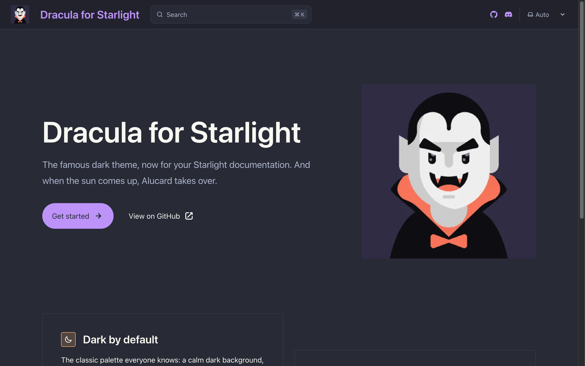
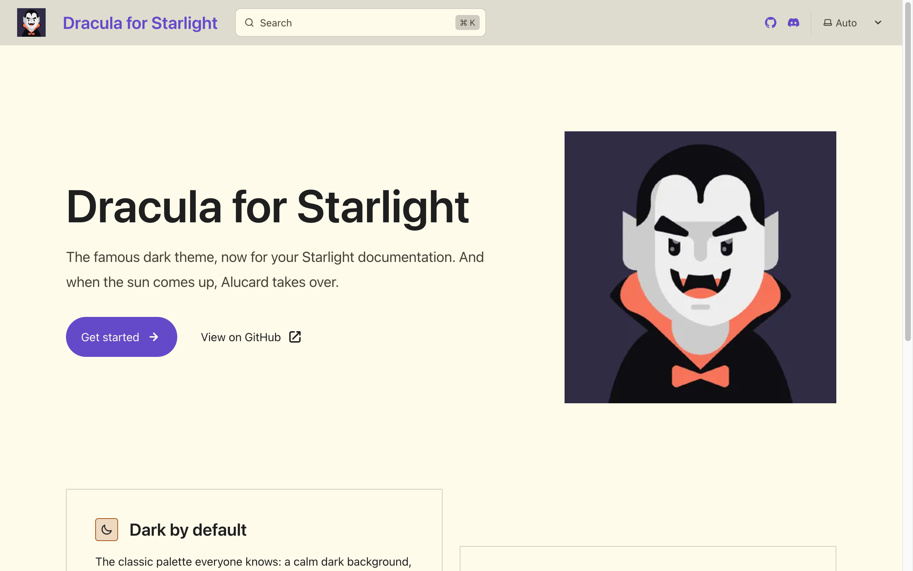

# Dracula for [Starlight](https://starlight.astro.build/)

> A dark theme for [Starlight](https://starlight.astro.build/).





Dark mode uses the classic Dracula palette, light mode uses [Alucard](https://draculatheme.com/spec), and code blocks come preconfigured with the Dracula syntax theme. Links and highlights can use any of the seven palette colors as an accent.

Check out the [documentation](https://wasi-master.github.io/dracula-for-starlight/) for all the details.

## Install

All instructions can be found at [INSTALL.md](./INSTALL.md).

## Development

This repository is an npm workspace: the theme lives in [`packages/starlight-theme-dracula`](./packages/starlight-theme-dracula) and the documentation site lives in [`docs`](./docs).

```bash
npm install
npm run dev
```

## Team

This theme is maintained by the following person(s) and a bunch of [awesome contributors](https://github.com/wasi-master/dracula-for-starlight/graphs/contributors).

| [](https://github.com/wasi-master) |
| --------------------------------------------------------------------------------------------- |
| [Wasi Master](https://github.com/wasi-master)                                                 |

## Community

- [Twitter](https://twitter.com/draculatheme) - Best for getting updates about themes and new stuff.
- [GitHub](https://github.com/dracula/dracula-theme/discussions) - Best for asking questions and discussing issues.
- [Discord](https://draculatheme.com/discord-invite) - Best for hanging out with the community.

## Dracula PRO

[](https://draculatheme.com/pro)

## License

[MIT License](./LICENSE)
